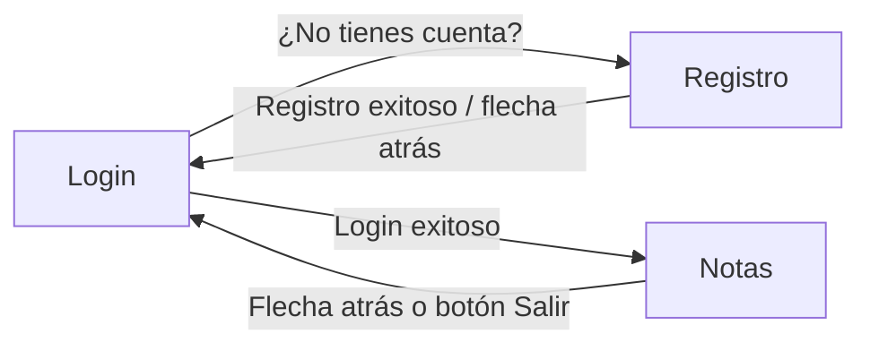

# MyNotesAppRoom

Aplicación Android desarrollada con **Jetpack Compose**, para el curso DSY1105 (Desarrollo de Aplicaciones Móviles).

Es la **misma aplicación** que [EA2-MisNotesAppPersistenciaSQLite](../EA2-MisNotesAppPersistenciaSQLite), pero reemplazando la persistencia en **Jetpack DataStore (Preferences)** por una base de datos **SQLite** administrada con **Room**. El objetivo pedagógico de este proyecto es comparar ambos enfoques de persistencia local en Android, manteniendo la interfaz y las reglas de negocio idénticas.

---

## 📱 Funcionalidades

- Registro de usuario con validación de email y confirmación de contraseña.
- Login con validación de formato de email y largo mínimo de contraseña.
- Pantalla de notas: agregar, listar y borrar notas asociadas al usuario que inició sesión.
- Persistencia real en una base de datos **SQLite** local (a través de Room), inspeccionable en vivo desde Android Studio.
- Navegación entre pantallas con **Navigation Compose**, con manejo correcto de la pila de navegación (flechas atrás y logout).

---

## 🛠️ Tecnologías y dependencias principales

| Tecnología | Uso en el proyecto |
|---|---|
| Kotlin + Jetpack Compose | UI declarativa de las 3 pantallas |
| Material 3 | Componentes visuales (`Scaffold`, `TopAppBar`, `OutlinedTextField`, `Button`, etc.) |
| Navigation Compose | Navegación entre Login, Registro y Notas |
| **Room** (`room-runtime`, `room-ktx`) | Persistencia de usuarios y notas en una base de datos SQLite |
| **KSP** (Kotlin Symbol Processing) | Genera en tiempo de compilación el código de acceso a datos a partir de las interfaces `@Dao` |
| Coroutines (`kotlinx.coroutines`) | Consultas e inserciones a la base de datos sin bloquear la UI |

---

## 📂 Estructura del proyecto

```
app/src/main/java/com/myapp/
├── MainActivity.kt
├── data/
│   ├── AppState.kt          // Estado global de la app (usuarios, sesión, notas)
│   └── room/
│       ├── UsuarioEntity.kt // Tabla "usuarios"
│       ├── NotaEntity.kt    // Tabla "notas"
│       ├── UsuarioDao.kt    // Consultas SQL sobre usuarios
│       ├── NotaDao.kt       // Consultas SQL sobre notas
│       └── AppDatabase.kt   // Base de datos Room (singleton)
├── navigation/
│   └── Navigation.kt        // Grafo de navegación (NavHost)
├── ui/
│   ├── theme/                // Tema Material generado por Android Studio
│   └── views/
│       ├── LoginScreen.kt
│       ├── RegistroScreen.kt
│       └── NotasScreen.kt
└── utils/
    └── Validaciones.kt       // Función reutilizable para validar formato de email
```

---

## 🧭 Flujo de navegación



> Al iniciar sesión, `Login` se saca de la pila de navegación (`popUpTo("login") { inclusive = true }`), así que desde `Notas` no existe ningún destino "anterior" al que volver — por eso ahí la flecha atrás cierra sesión en vez de simplemente navegar hacia atrás.

---

## 🧩 Explicación paso a paso del código

### 1. `MainActivity.kt` — punto de entrada

```kotlin
val db = AppDatabase.getInstance(applicationContext)
val appState = AppState(db)
appState.cargarDatos() // carga inicial desde SQLite
setContent { MyApp(appState) }
```

- `AppDatabase.getInstance(...)` crea (o reutiliza, si ya existe) la única instancia de la base de datos Room de toda la app.
- `AppState` recibe esa base de datos y la usa para leer/escribir a través de los DAOs.
- El resto es idéntico a la versión con DataStore: `cargarDatos()` trae los usuarios guardados a memoria, y Compose se encarga de todo lo demás.

### 2. `data/room/UsuarioEntity.kt` y `NotaEntity.kt` — las tablas

```kotlin
@Entity(tableName = "usuarios")
data class UsuarioEntity(
    @PrimaryKey val email: String,
    val password: String
)

@Entity(tableName = "notas")
data class NotaEntity(
    @PrimaryKey(autoGenerate = true) val id: Long = 0,
    val emailUsuario: String,
    val texto: String
)
```

- `@Entity` le dice a Room que esta clase representa una **tabla**; cada propiedad es una **columna**.
- `@PrimaryKey` marca la clave primaria. En `UsuarioEntity` usamos el propio `email` (no puede haber dos usuarios con el mismo correo). En `NotaEntity` usamos un `id` autogenerado (1, 2, 3...), y `emailUsuario` es la columna que relaciona cada nota con su dueño — es el equivalente, en una base de datos relacional, al `Map<String, List<String>>` que se usaba con DataStore.

### 3. `data/room/UsuarioDao.kt` y `NotaDao.kt` — las consultas

```kotlin
@Dao
interface NotaDao {
    @Insert
    suspend fun insertar(nota: NotaEntity): Long

    @Query("SELECT * FROM notas WHERE emailUsuario = :email ORDER BY id")
    suspend fun obtenerPorUsuario(email: String): List<NotaEntity>

    @Delete
    suspend fun eliminar(nota: NotaEntity)
}
```

- Un **DAO** (*Data Access Object*) es una interfaz donde **solo se declaran** las operaciones (qué se quiere hacer); Room genera automáticamente, en tiempo de compilación (gracias a KSP), la clase real que ejecuta el SQL.
- `@Insert` y `@Delete` son anotaciones "listas para usar": Room sabe qué hacer con ellas sin necesidad de escribir SQL.
- `@Query` sí requiere que escribas el SQL a mano (`SELECT ... WHERE ...`), útil para consultas más específicas como "traer solo las notas de este usuario".
- Todas las funciones son `suspend`: se ejecutan en una corrutina, nunca bloquean el hilo principal.

### 4. `data/room/AppDatabase.kt` — la base de datos

```kotlin
@Database(entities = [UsuarioEntity::class, NotaEntity::class], version = 1, exportSchema = false)
abstract class AppDatabase : RoomDatabase() {
    abstract fun usuarioDao(): UsuarioDao
    abstract fun notaDao(): NotaDao

    companion object {
        @Volatile private var INSTANCE: AppDatabase? = null

        fun getInstance(context: Context): AppDatabase {
            return INSTANCE ?: synchronized(this) {
                Room.databaseBuilder(context.applicationContext, AppDatabase::class.java, "mis_notas_db")
                    .build().also { INSTANCE = it }
            }
        }
    }
}
```

- `@Database` enumera todas las entidades (tablas) que existen y en qué **versión** de esquema está la base de datos. Si más adelante agregas o modificas una columna, hay que subir este número y proveer una migración.
- El patrón `@Volatile` + `synchronized` + `INSTANCE` es el clásico **Singleton thread-safe**: garantiza que exista una sola conexión a la base de datos en toda la app, sin importar desde cuántos lugares se llame a `getInstance()`.
- El archivo físico de la base de datos se llama `mis_notas_db` y vive en el almacenamiento privado de la app en el dispositivo.

### 5. `data/AppState.kt` — el estado global de la app

```kotlin
class AppState(private val db: AppDatabase) {
    val usuarios = mutableStateListOf<Usuario>()
    var usuarioActual: Usuario? = null
        private set
    private val notasPorUsuario = mutableStateMapOf<String, SnapshotStateList<NotaEntity>>()
    ...
}
```

- Mantiene **exactamente la misma API pública** que la versión con DataStore (`login`, `registrarUsuario`, `logout`, `agregarNota`, `obtenerNotas`, `borrarNota`, `cargarDatos`). Esto es intencional: así ninguna pantalla necesita cambiar cuando se cambia la forma de persistir los datos.
- Usa el mismo patrón de siempre: una copia **reactiva en memoria** (que Compose observa) sincronizada con la base de datos en segundo plano mediante corrutinas (`scope.launch { ... }`). Las lecturas son instantáneas (vienen de memoria); las escrituras se reflejan primero en memoria (para que la UI reaccione al instante) y luego se guardan en SQLite de forma asíncrona.
- Las notas de cada usuario se cargan recién al hacer login (`cargarNotasDe(email)`), no todas de una vez al abrir la app — más eficiente si hubiera muchos usuarios registrados.

### 6. `navigation/Navigation.kt`, `ui/views/*.kt` y `utils/Validaciones.kt`

Sin cambios respecto a la versión con DataStore — mismas pantallas, mismas validaciones, misma navegación. Ver el README de [MyNotesAppPersistencia](../MyNotesAppPersistencia) para el detalle pantalla por pantalla.

---

## ✅ Mejoras que trae este proyecto (heredadas de MyNotesAppPersistencia)

| Mejora | Detalle |
|---|---|
| Logout accesible desde Notas | Botón "Salir" + flecha atrás, ambos cierran sesión correctamente |

## 🆕 Lo específico de esta versión (migración a Room)

| Cambio | Antes (DataStore) | Ahora (Room) |
|---|---|---|
| Forma de guardar datos | JSON serializado con Gson dentro de Preferences | Tablas SQL reales (`usuarios`, `notas`) |
| Relación usuario-notas | `Map<String, List<String>>` en un solo blob | Columna `emailUsuario` (clave foránea "manual") en la tabla `notas` |
| Acceso a los datos | Métodos manuales en `DataStoreManager` | Interfaces `@Dao` generadas por Room/KSP |
| Inspección de datos | No es visual (hay que decodificar el JSON a mano) | **Database Inspector** de Android Studio, en vivo |
| Dependencias nuevas | — | `room-runtime`, `room-ktx`, `room-compiler` + plugin `KSP` |

---

## ▶️ Cómo ejecutar el proyecto

1. Clonar el repositorio y abrirlo con **Android Studio** (versión reciente, con soporte para Kotlin 2.0+, KSP y Compose).
2. Esperar a que Gradle sincronice automáticamente (o **File > Sync Project with Gradle Files** si no ocurre solo). La primera sincronización puede tardar un poco más de lo normal porque KSP genera código nuevo.
3. Ejecutar la app (▶) en un emulador o dispositivo físico con **Android 7.0 (API 24)** o superior.
4. Registrar un usuario de prueba y luego iniciar sesión con esas credenciales para llegar a la pantalla de Notas.
5. (Opcional, para ver la base de datos) Con la app corriendo, ir a **View > Tool Windows > App Inspection > Database Inspector** y explorar las tablas `usuarios` y `notas` en tiempo real.

---

## 🚧 Próximos pasos

- Definir una **migración de Room** cuando se agregue una nueva columna o tabla (por ejemplo, fecha de creación de cada nota), en vez de simplemente aumentar la `version` sin migración (lo que hoy borraría los datos existentes).
- Hashear las contraseñas antes de guardarlas (actualmente se guardan en texto plano, aceptable solo para fines educativos).
- Editar notas existentes, no solo crearlas y borrarlas.
- Explorar `Flow` en los DAOs (`fun obtenerPorUsuario(email: String): Flow<List<NotaEntity>>`) para que la UI se actualice automáticamente ante cualquier cambio en la base de datos, sin necesidad de recargar manualmente el caché en memoria.

---

*Proyecto desarrollado para fines educativos — DSY1105, Desarrollo de Aplicaciones Móviles.*
