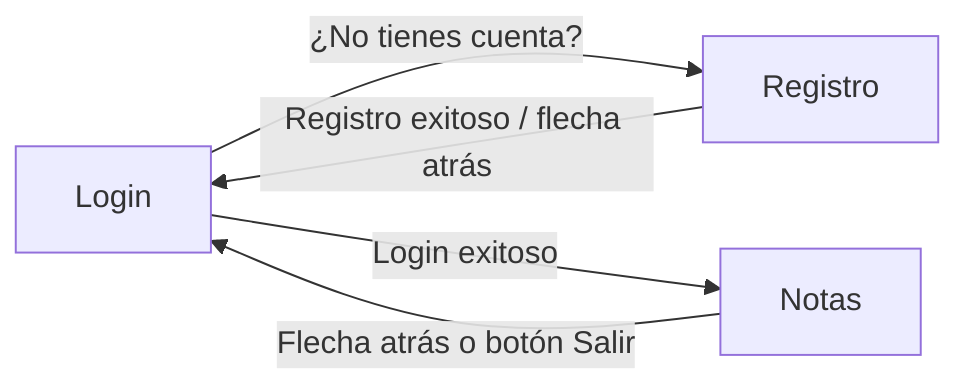

# MyNotesAppPersistencia

Aplicación Android desarrollada con **Jetpack Compose** para el curso DSY1105 (Desarrollo de Aplicaciones Móviles), como parte de la Experiencia de Aprendizaje N°2.

Permite a un usuario **registrarse**, **iniciar sesión** y **guardar notas personales**, persistiendo tanto los usuarios como las notas en el dispositivo mediante **Jetpack DataStore (Preferences)**, de modo que la información sobrevive a que la app se cierre o el dispositivo se reinicie.

---

## 📱 Funcionalidades

- Registro de usuario con validación de email y confirmación de contraseña.
- Login con validación de formato de email y largo mínimo de contraseña.
- Pantalla de notas: agregar, listar y borrar notas asociadas al usuario que inició sesión.
- Persistencia real en disco (DataStore + Gson), no se pierde nada al cerrar la app.
- Navegación entre pantallas con **Navigation Compose**, con manejo correcto de la pila de navegación (flechas atrás y logout).

---

## 🛠️ Tecnologías y dependencias principales

| Tecnología | Uso en el proyecto |
|---|---|
| Kotlin + Jetpack Compose | UI declarativa de las 3 pantallas |
| Material 3 | Componentes visuales (`Scaffold`, `TopAppBar`, `OutlinedTextField`, `Button`, etc.) |
| Navigation Compose | Navegación entre Login, Registro y Notas |
| Jetpack DataStore (Preferences) | Persistencia de usuarios y notas en disco |
| Gson | Serializar/deserializar listas y mapas a JSON para guardarlos en DataStore |
| Coroutines (`kotlinx.coroutines`) | Lectura/escritura asíncrona de DataStore sin bloquear la UI |

---

## 📂 Estructura del proyecto

```
app/src/main/java/com/myapp/
├── MainActivity.kt
├── data/
│   ├── AppState.kt          // Estado global de la app (usuarios, sesión, notas)
│   └── DataStoreManager.kt  // Acceso de bajo nivel a DataStore
├── navigation/
│   └── Navigation.kt        // Grafo de navegación (NavHost)
├── ui/
│   ├── theme/                // Tema Material generado por Android Studio
│   └── views/
│       ├── LoginScreen.kt
│       ├── RegistroScreen.kt
│       └── NotasScreen.kt
└── utils/
    └── Validaciones.kt       // Función reutilizable para validar formato de email
```

---

## 🧭 Flujo de navegación



> Un detalle importante: al iniciar sesión, `Login` se saca de la pila de navegación (`popUpTo("login") { inclusive = true }`), así que desde `Notas` no existe ningún destino "anterior" al que volver — por eso ahí la flecha atrás cierra sesión en vez de simplemente navegar hacia atrás.

---

## 🧩 Explicación paso a paso del código

### 1. `MainActivity.kt` — punto de entrada

```kotlin
val dataStore = DataStoreManager(applicationContext)
val appState = AppState(dataStore)
appState.cargarDatos() // carga inicial desde disco
setContent { MyApp(appState) }
```

- Crea el `DataStoreManager`, que sabe leer/escribir en disco.
- Crea `AppState`, que es el "cerebro" de la app: mantiene los datos en memoria (reactivos, para que Compose los observe) y delega en `DataStoreManager` cuándo guardarlos.
- `appState.cargarDatos()` dispara la carga asíncrona de usuarios y notas guardadas previamente, apenas se abre la app.
- `setContent` entrega el control a Compose, mostrando `MyApp(appState)`, que a su vez monta el `NavHost` a través de `AppNavigation`.

### 2. `data/DataStoreManager.kt` — la capa de persistencia

```kotlin
val Context.dataStore by preferencesDataStore(name = "app_prefs")
```

- Declara un DataStore de tipo Preferences llamado `app_prefs` (se traduce en un archivo en el almacenamiento interno de la app).
- Como DataStore solo guarda tipos simples (String, Int, Boolean, etc.), usamos **Gson** para convertir la lista de usuarios y el mapa de notas a JSON (`String`) antes de guardarlos, y para reconstruirlos al leerlos.
- `saveUsers()` / `getUsers()` y `saveNotes()` / `getNotes()` son las únicas 4 operaciones que expone: guardar/leer usuarios, guardar/leer notas. Todo lo demás (validar, buscar, etc.) es responsabilidad de `AppState`, no de esta clase — así cada clase tiene una sola razón para cambiar (principio de responsabilidad única).

### 3. `data/AppState.kt` — el estado global de la app

```kotlin
data class Usuario(val email: String, val password: String)

class AppState(private val dataStore: DataStoreManager) {
    val usuarios = mutableStateListOf<Usuario>()
    var usuarioActual: Usuario? = null
    val notasPorUsuario = mutableStateMapOf<String, SnapshotStateList<String>>()
    ...
}
```

- `usuarios` y `notasPorUsuario` son colecciones **reactivas de Compose** (`mutableStateListOf` / `mutableStateMapOf`): cuando cambian, cualquier pantalla que las esté leyendo se recompone automáticamente.
- `cargarDatos()` lee desde `DataStoreManager` (usando `.first()` sobre el `Flow`, es decir, "tráeme el valor actual una sola vez") y llena esas colecciones al iniciar la app.
- `registrarUsuario()`, `login()`, `logout()`, `agregarNota()`, `obtenerNotas()`, `borrarNota()`: son la única "API" que las pantallas conocen. Ninguna pantalla sabe que por debajo hay DataStore, Gson o archivos — solo le piden cosas a `AppState`. Esto es **separación de responsabilidades**: la UI no sabe cómo se persisten los datos, y `AppState` no sabe cómo se dibuja la UI.
- Cada operación que modifica datos actualiza primero la colección en memoria (para que la UI reaccione al instante) y luego dispara un `scope.launch { ... }` para guardar el cambio en disco en segundo plano, sin bloquear el hilo principal.

### 4. `navigation/Navigation.kt` — el grafo de navegación

```kotlin
NavHost(navController = navController, startDestination = "login") {
    composable("login") { LoginScreen(navController, appState) }
    composable("registro") { RegistroScreen(navController, appState) }
    composable("notas") { NotasScreen(navController, appState) }
}
```

- Define las 3 "rutas" de la app y qué composable se muestra en cada una.
- `appState` se pasa a las tres pantallas: es el mismo objeto para todas (se crea una sola vez en `MainActivity`), por lo que los datos se mantienen consistentes sin importar a qué pantalla se navegue.

### 5. `ui/views/LoginScreen.kt`

Valida, en orden:
1. Que ni el usuario ni la contraseña estén en blanco.
2. Que el usuario tenga formato de email válido (`esEmailValido()`, definido en `utils/Validaciones.kt`).
3. Que la contraseña tenga al menos 3 caracteres.
4. Que `appState.login(usuario, password)` devuelva `true` (o sea, que exista ese usuario con esa contraseña).

Si todo pasa, navega a `"notas"` **sacando `"login"` de la pila** (`popUpTo("login") { inclusive = true }`), para que no se pueda volver a una sesión ya iniciada presionando "atrás".

El campo de contraseña usa `visualTransformation = PasswordVisualTransformation()` para mostrar los caracteres ocultos (•••), como en cualquier app real.

### 6. `ui/views/RegistroScreen.kt`

Incluye un campo extra de **"Confirmar contraseña"**. Valida, en orden:
1. Que ningún campo esté en blanco.
2. Que el email tenga formato válido.
3. Que la contraseña tenga al menos 4 caracteres.
4. Que la contraseña y su confirmación coincidan.
5. Que el email no esté ya registrado (`appState.registrarUsuario()` devuelve `false` si ya existe).

Si el registro es exitoso, vuelve al Login con `navController.popBackStack()` (en vez de crear una nueva instancia de Login encima), y su `TopAppBar` incluye una flecha atrás que hace exactamente lo mismo.

### 7. `ui/views/NotasScreen.kt`

- Un `OutlinedTextField` + botón "Guardar Nota" que solo agrega la nota si `nota.isNotBlank()`.
- Una `LazyColumn` que lista las notas del usuario actual, cada una con su propio botón "Borrar".
- El `TopAppBar` tiene **dos maneras de cerrar sesión**: la flecha atrás y el botón "Salir", ambas llaman a la misma función interna `cerrarSesion()` (que hace `appState.logout()` y navega a `"login"` limpiando la pila). Son dos caminos al mismo resultado, porque desde esta pantalla no existe una pantalla "anterior" real a la que volver.

### 8. `utils/Validaciones.kt`

```kotlin
private val EMAIL_REGEX = Regex("^[A-Za-z0-9._%+-]+@[A-Za-z0-9.-]+\\.[A-Za-z]{2,}$")

fun esEmailValido(email: String): Boolean {
    return EMAIL_REGEX.matches(email.trim())
}
```

Una única función reutilizada por `LoginScreen` y `RegistroScreen`, para no repetir la misma expresión regular en dos archivos distintos (principio DRY — *Don't Repeat Yourself*).

---

## ✅ Mejoras implementadas sobre la versión inicial

Esta versión incorpora un conjunto de mejoras respecto a la primera entrega funcional del proyecto:

| Mejora | Antes | Ahora |
|---|---|---|
| Validación de email en Login | No existía | `esEmailValido()` obligatorio |
| Largo mínimo de contraseña en Login | No existía | Mínimo 3 caracteres |
| Contraseña oculta | Se mostraba en texto plano | `PasswordVisualTransformation()` |
| Validación de email en Registro | Solo verificaba que tuviera un `@` | `esEmailValido()` (regex completa) |
| Confirmación de contraseña en Registro | No existía | Campo "Confirmar Contraseña" con validación de coincidencia |
| Utilidad de validación centralizada | Lógica duplicada/inline en cada pantalla | `utils/Validaciones.kt` reutilizable |
| Navegación tras login/registro exitoso | `navigate()` simple (la pila crecía sin control) | `popUpTo`/`popBackStack` para mantener la pila limpia |
| Flecha atrás en Registro | No existía | `navigationIcon` que hace `popBackStack()` |
| Flecha atrás y logout en Notas | Solo existía "Salir" | Flecha atrás + "Salir", ambas cierran sesión correctamente |

---

## ▶️ Cómo ejecutar el proyecto

1. Clonar el repositorio y abrirlo con **Android Studio** (versión reciente, con soporte para Kotlin 2.0+ y Compose).
2. Esperar a que Gradle sincronice automáticamente (o **File > Sync Project with Gradle Files** si no ocurre solo).
3. Ejecutar la app (▶) en un emulador o dispositivo físico con **Android 7.0 (API 24)** o superior.
4. Registrar un usuario de prueba y luego iniciar sesión con esas credenciales para llegar a la pantalla de Notas.

---

## 🚧 Próximos pasos

- Existe una variante de este mismo proyecto que reemplaza DataStore por **Room (SQLite)** como capa de persistencia, manteniendo las mismas pantallas y la misma lógica de validación — útil para comparar ambos enfoques de persistencia local en Android.
- Posibles mejoras futuras: hashear las contraseñas antes de guardarlas (actualmente se guardan en texto plano, aceptable solo para fines educativos), agregar recuperación de contraseña, y editar notas existentes (actualmente solo se pueden crear y borrar).

---

*Proyecto desarrollado para fines educativos — DSY1105, Desarrollo de Aplicaciones Móviles.*
